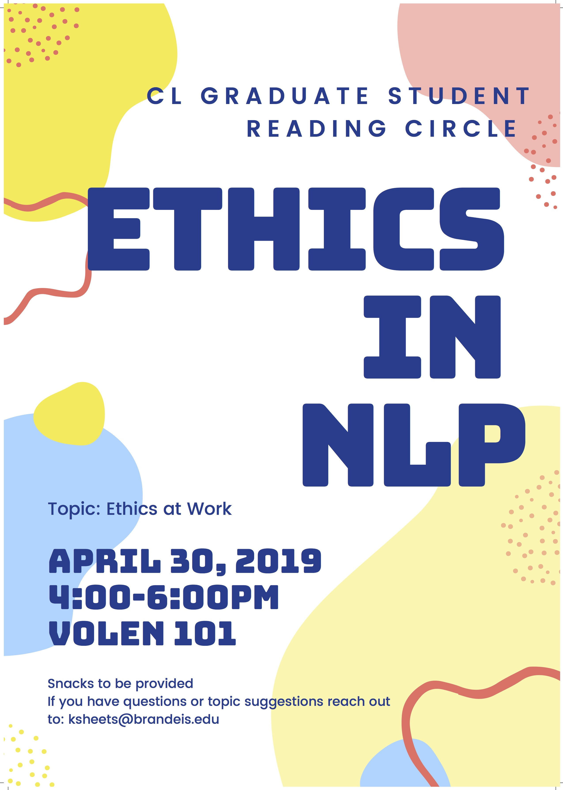

# Welcome to our home page!
## This the *Ethics in NLP* reading circle at Brandeis.  

Our next meeting will be April 30th, 2019. We'll be talking about Ethics at Work with a guest speaker from the *Tech Workers Coalition*. Below you'll find suggested readings for the meeting.  

**Readings:**
- [Microsoft and GitHub Workers Support 996.ICU](https://github.com/MSWorkers/support.996.ICU?)  
- [Thousands of Amazon employees ask the company to adopt a climate change plan](https://www.theverge.com/2019/4/10/18304800/amazon-employees-open-letter-climate-change-plan)  
- [An Open Letter to Uber: We Need to Do Right By Our Drivers](https://onezero.medium.com/an-open-letter-to-uber-we-need-to-do-right-by-our-drivers-81453fad41e1)  
- [Microsoft Employees Protest Work With ICE, as Tech Industry Mobilizes Over Immigration](https://www.nytimes.com/2018/06/19/technology/tech-companies-immigration-border.html)
- [Tech Workers Versus the Pentagon](https://jacobinmag.com/2018/06/google-project-maven-military-tech-workers)
- [Google Workers Reject Silicon Valley Individualism in Walkout](https://www.nytimes.com/2018/11/06/business/google-employee-walkout-labor.html)
- [At Google workers' town hall, employees pledge to protect each other from retaliation](https://www.cnet.com/google-amp/news/at-google-town-hall-workers-pledge-to-protect-each-other-from-retaliation/)
- [Facebook contractors faced Christmas ultimatum: accept wage offer or lose jobs](https://www.theguardian.com/technology/2018/dec/20/facebook-contractors-filter-digital-labor-dispute-christmas)
- [Kickstarter’s staff is unionizing](https://www.theverge.com/2019/3/19/18254995/kickstarter-unionizing-union-representation-inclusivity-transparency-tech-us-crowdfunding)
- [Why Silicon Valley can’t fix itself](https://www.theguardian.com/news/2018/may/03/why-silicon-valley-cant-fix-itself-tech-humanism)

